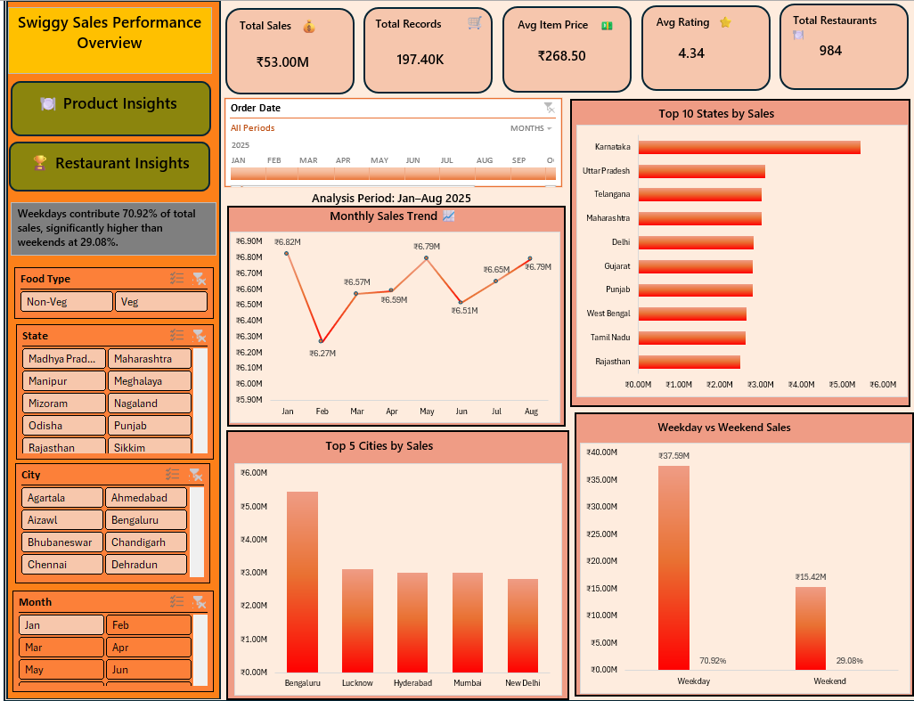

# Swiggy Sales Analysis Dashboard – Excel

## 📊 Project Overview

This project analyzes **Swiggy food-ordering data for 2025 (January–August)** using Microsoft Excel. The dashboard provides an interactive view of sales performance, customer transactions, restaurant performance, locations, food types, ratings, and pricing segments.

The objective is to transform raw food-order data into meaningful business insights that can help identify **top-performing restaurants, locations, food categories, and pricing segments**.

---

## 🎯 Business Objectives

* Analyze overall sales and transaction performance.
* Identify top-performing restaurants and locations.
* Compare sales performance across cities and states.
* Analyze customer ordering behavior by food type.
* Understand the relationship between sales and restaurant ratings.
* Analyze sales across different price bands.
* Compare weekday and weekend sales performance.
* Build an interactive dashboard for business analysis.

---

## 🛠️ Tools & Technologies

* **Microsoft Excel**
* Pivot Tables
* Pivot Charts
* Slicers
* Excel formulas
* Data Cleaning & Transformation
* Dashboard Design
* Data Analysis & Visualization

---

## 📌 Key KPIs

| KPI                       |   Value |
| ------------------------- | ------: |
| Total Sales               | ₹53.01M |
| Total Transactions        | 197.40K |
| Average Transaction Value | ₹267.50 |
| Average Rating            |    4.34 |
| Total Rating Count        |     984 |

---

## 📈 Dashboard Analysis

### Sales Performance

The dashboard analyzes overall sales performance and provides a breakdown of sales across different geographical and business dimensions.

### Restaurant Analysis

The dashboard identifies the highest-performing restaurants based on sales.

**Top 5 Restaurants by Sales:**

1. KFC – ₹4.25M
2. McDonald's – ₹3.34M
3. Pizza Hut – ₹2.13M
4. Burger King – ₹1.90M
5. Domino's – ₹1.83M

### Location Analysis

Sales performance is analyzed across cities, states, and individual locations to identify high-performing geographical areas.

### Food Type Analysis

Sales are compared between **Vegetarian and Non-Vegetarian** food orders.

* Vegetarian Sales: ₹34.61M
* Non-Vegetarian Sales: ₹18.40M

### Weekday vs Weekend Analysis

The dashboard compares sales based on ordering days.

* Weekday Sales: ₹37.59M
* Weekend Sales: ₹15.42M

This shows that the majority of recorded sales occurred on weekdays during the analyzed period.

### Price Band Analysis

Orders are segmented into three price bands:

| Price Band |   Sales |
| ---------- | ------: |
| Budget     |  ₹5.20M |
| Mid-Range  | ₹18.88M |
| Premium    | ₹28.92M |

The **Premium** segment generated the highest sales among the three price categories.

---

## 🎛️ Interactive Filters

The dashboard includes slicers that allow users to dynamically filter the analysis by:

* Month
* City
* State
* Food Type

These filters make it easier to explore sales performance across different business dimensions.

---

## 💡 Key Insights

* Total sales during the analyzed period reached approximately **₹53.01M**.
* KFC generated the highest sales among the analyzed restaurants.
* Vegetarian food generated higher sales than Non-Vegetarian food.
* Weekday sales were significantly higher than weekend sales.
* Premium-priced orders contributed the largest share of sales among the three price bands.
* The dashboard enables quick comparison of restaurant, location, food type, and pricing performance.

---

## 📷 Dashboard Preview

Add your dashboard screenshot to the `screenshots` folder and rename it:

```text
dashboard.png
```

Then use:

```markdown

```

---

## 📂 Repository Structure

```text
Swiggy-Sales-Analysis-Excel/
│
├── README.md
├── Swiggy sales analysis excel dashboard.xlsx
│
└── screenshots/
    └── dashboard.png
```

---

## 🚀 Skills Demonstrated

* Data Cleaning
* Data Analysis
* Excel Pivot Tables
* Pivot Charts
* Interactive Slicers
* KPI Development
* Dashboard Development
* Business Intelligence
* Data Visualization
* Business Insight Generation

---

## 👩‍💻 Project Purpose

This project was developed as a **portfolio project to demonstrate practical Excel data analysis and dashboard development skills** for a Data Analyst role.
